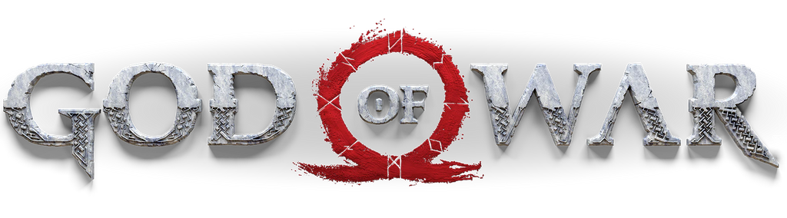

<div align="center">
  

  <h3>God Of War Page re-imagined</h3>

  <p>Creado con fines de aprendisaje</p>
</div>

> [!WARNING]
> Esta página no es oficial, la página oficial es [**playstation.com**](https://www.playstation.com/es-co/god-of-war//).


## 🛠️ Herramientas.

- [**Astro**](https://astro.build/) - El framework para sitios webs mayormenteestáticos.
<br>

- [**Tailwindcss**](https://tailwindcss.com/) - El framework de CSS que ayuda a el rápido estilado y diseños personalizados.

## 🚀 Como instalar.

1. Clona este repositorio.

```bash
git clone https://github.com/andr3safk/God-of-war-clone-page
```

2. Instala las dependencias.

- Es importante tener la versión 18 o superior de [**Node.js**](https://nodejs.org/es).

```bash
# Ejecuta el sguiente comando para instalar las dependencias
npm install.
```

3. Pon en marcha el entorno de desarrollo:

```bash
npm run dev
```

4. Abre [**http://localhost:4321**](http://localhost:4321/) en tu navegador y observa tus cambios.

## Enlaces ⛓️

- Iconos tomado de la web: [**iconos8.es**](https://iconos8.es)